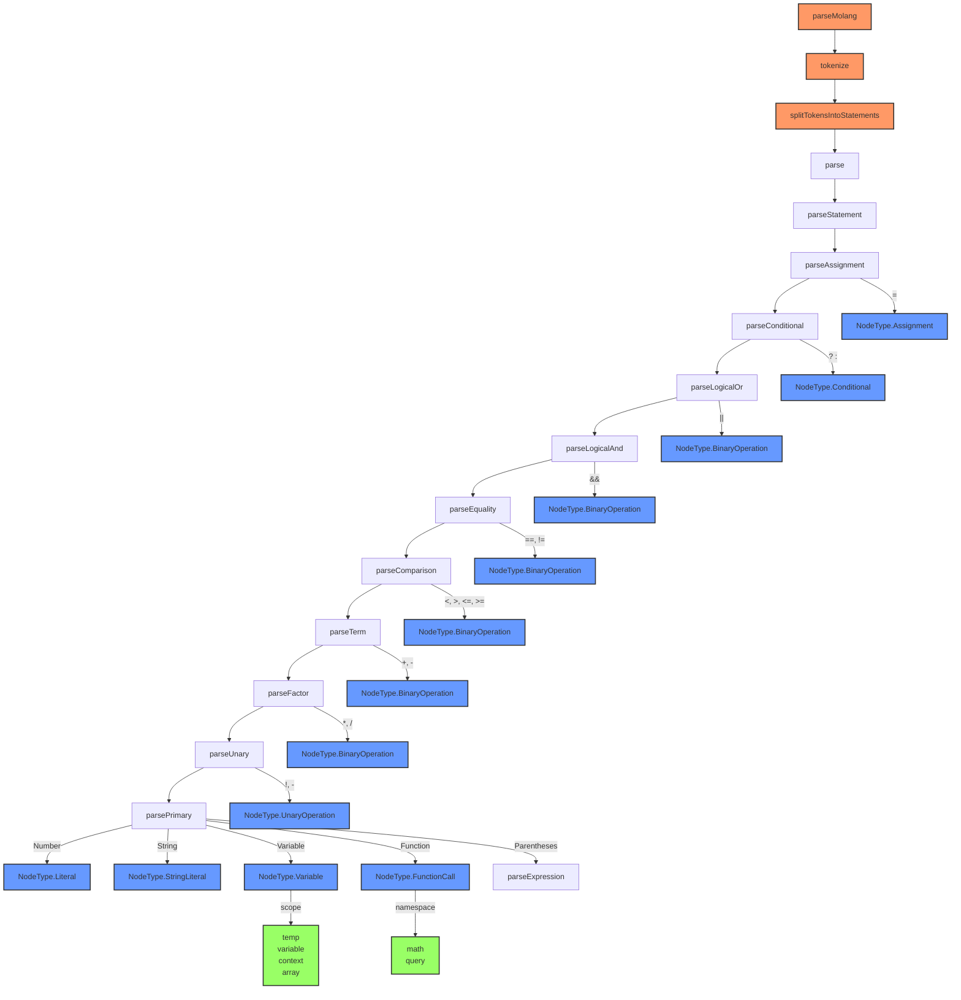

# Molang Parser Flow

This diagram shows the precedence-based parsing flow of the Molang parser:

1. Entry point through `parseMolang`
   - Tokenizes input
   - Splits into statements
   - Creates parser instance

2. Precedence levels (highest to lowest):
   - Primary expressions (literals, variables, functions)
   - Unary operations (!, -)
   - Multiplicative (*, /)
   - Additive (+, -)
   - Comparison (<, >, <=, >=)
   - Equality (==, !=)
   - Logical AND (&&)
   - Logical OR (||)
   - Conditional (? :)
   - Assignment (=)

3. Node types produced:
   - Literal (numbers)
   - StringLiteral (strings)
   - Variable (with scopes: temp, variable, context, array)
   - FunctionCall (with namespaces: math, query)
   - UnaryOperation
   - BinaryOperation
   - Conditional
   - Assignment

Each parsing function follows the precedence rules and delegates to the next higher precedence level when needed.
