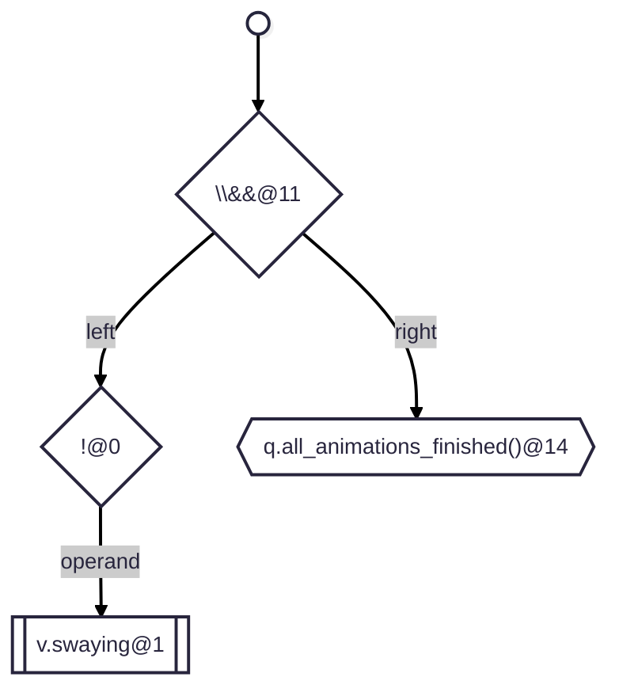
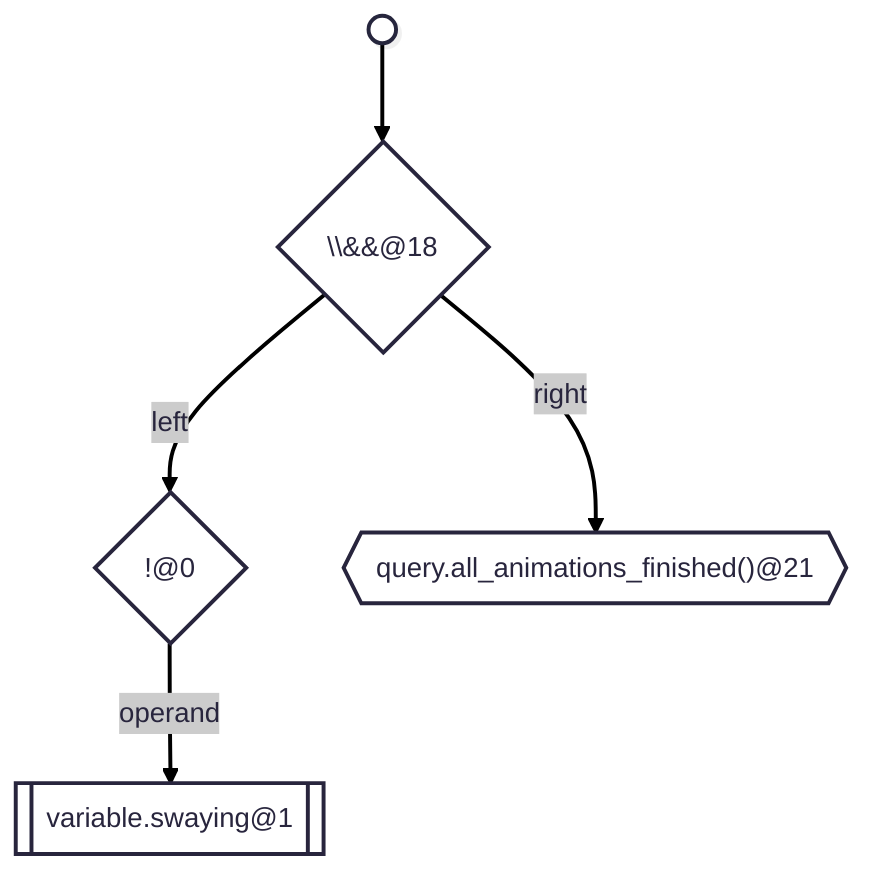
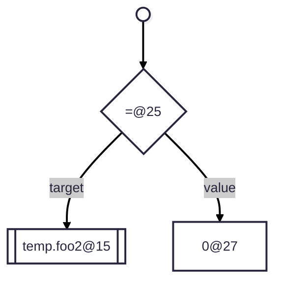
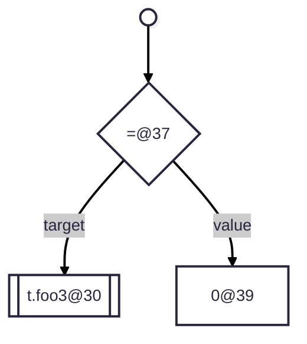
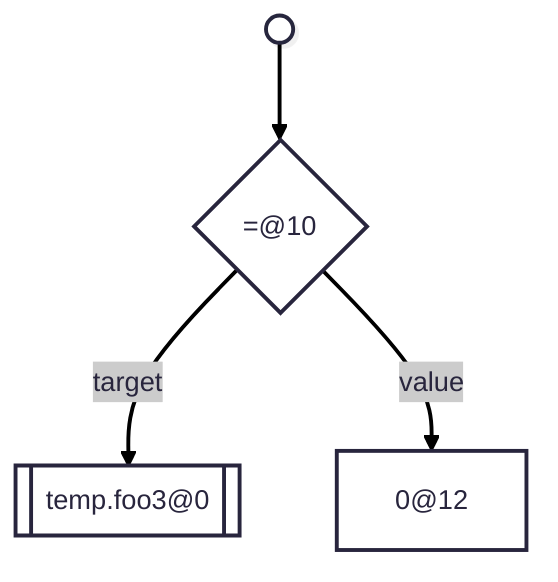
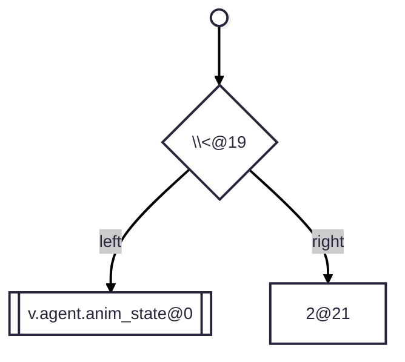
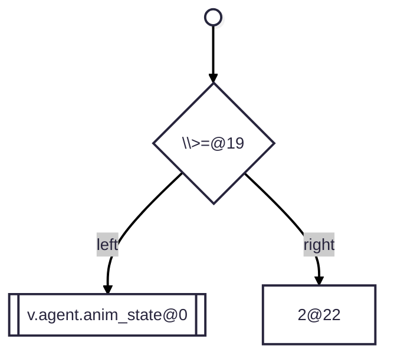
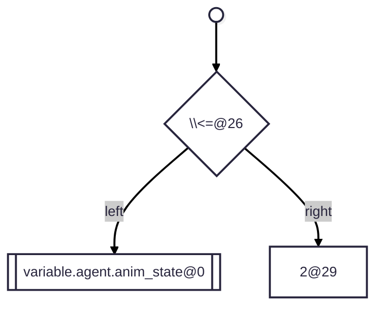
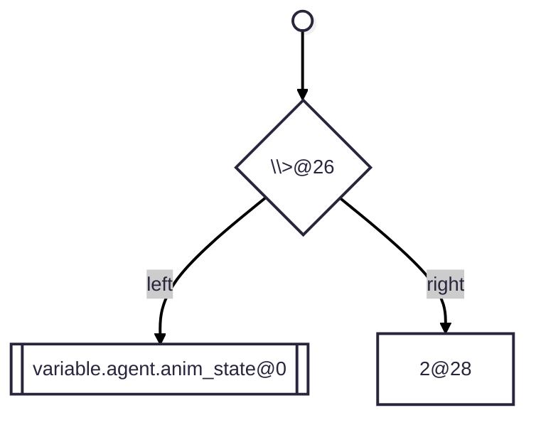

# Snapshot

## 0. !v.swaying && q.all_animations_finished 1


## 1. !variable.swaying && query.all_animations_finished 1


## 2. temp.foo1 = 0; temp.foo2 = 0; t.foo3 = 0; 1


## 2. temp.foo1 = 0; temp.foo2 = 0; t.foo3 = 0; 2


## 2. temp.foo1 = 0; temp.foo2 = 0; t.foo3 = 0; 3


## 3. temp.foo1 = 0; temp.foo2 = 0; t.foo3 = 0; 1


## 3. temp.foo1 = 0; temp.foo2 = 0; t.foo3 = 0; 2


## 3. temp.foo1 = 0; temp.foo2 = 0; t.foo3 = 0; 3


## 4. temp.foo3 = 0; 1


## 5. v.agent.anim_state != 2 1


## 6. v.agent.anim_state < 2 1


## 7. v.agent.anim_state <= 2 1


## 8. v.agent.anim_state == 2 1


## 9. v.agent.anim_state > 2 1


## 10. v.agent.anim_state >= 2 1


## 11. variable.agent.anim_state != 2 1


## 12. variable.agent.anim_state < 2 1


## 13. variable.agent.anim_state <= 2 1


## 14. variable.agent.anim_state == 2 1


## 15. variable.agent.anim_state > 2 1


## 16. variable.agent.anim_state >= 2 1
```mermaid
---
config:
    theme: redux
---
flowchart TD
    start@{ shape: sm-circ, label: "Small start" }
    node0{"\\>=@26"}
    node1[["variable.agent.anim_state@0"]]
    node2["2@29"]
    start-->node0
    node0 -->|left| node1
    node0 -->|right| node2
```

## 17. variable.armor_stand.hurt_time = 0; 1
```mermaid
---
config:
    theme: redux
---
flowchart TD
    start@{ shape: sm-circ, label: "Small start" }
    node0{"=@31"}
    node1[["variable.armor_stand.hurt_time@0"]]
    node2["0@33"]
    start-->node0
    node0 -->|target| node1
    node0 -->|value| node2
```

## 18. variable.armor_stand.pose_index = 0; 1
```mermaid
---
config:
    theme: redux
---
flowchart TD
    start@{ shape: sm-circ, label: "Small start" }
    node0{"=@32"}
    node1[["variable.armor_stand.pose_index@0"]]
    node2["0@34"]
    start-->node0
    node0 -->|target| node1
    node0 -->|value| node2
```

## 19. variable.foo1 = 0; variable.foo2 = 0; v.foo3 = 0; 1
```mermaid
---
config:
    theme: redux
---
flowchart TD
    start@{ shape: sm-circ, label: "Small start" }
    node0{"=@14"}
    node1[["variable.foo1@0"]]
    node2["0@16"]
    start-->node0
    node0 -->|target| node1
    node0 -->|value| node2
```

## 19. variable.foo1 = 0; variable.foo2 = 0; v.foo3 = 0; 2
```mermaid
---
config:
    theme: redux
---
flowchart TD
    start@{ shape: sm-circ, label: "Small start" }
    node0{"=@33"}
    node1[["variable.foo2@19"]]
    node2["0@35"]
    start-->node0
    node0 -->|target| node1
    node0 -->|value| node2
```

## 19. variable.foo1 = 0; variable.foo2 = 0; v.foo3 = 0; 3
```mermaid
---
config:
    theme: redux
---
flowchart TD
    start@{ shape: sm-circ, label: "Small start" }
    node0{"=@45"}
    node1[["v.foo3@38"]]
    node2["0@47"]
    start-->node0
    node0 -->|target| node1
    node0 -->|value| node2
```

## 20. variable.foo1 = 0; variable.foo2 = 0; v.foo3 = 0; 1
```mermaid
---
config:
    theme: redux
---
flowchart TD
    start@{ shape: sm-circ, label: "Small start" }
    node0{"=@14"}
    node1[["variable.foo1@0"]]
    node2["0@16"]
    start-->node0
    node0 -->|target| node1
    node0 -->|value| node2
```

## 20. variable.foo1 = 0; variable.foo2 = 0; v.foo3 = 0; 2
```mermaid
---
config:
    theme: redux
---
flowchart TD
    start@{ shape: sm-circ, label: "Small start" }
    node0{"=@33"}
    node1[["variable.foo2@19"]]
    node2["0@35"]
    start-->node0
    node0 -->|target| node1
    node0 -->|value| node2
```

## 20. variable.foo1 = 0; variable.foo2 = 0; v.foo3 = 0; 3
```mermaid
---
config:
    theme: redux
---
flowchart TD
    start@{ shape: sm-circ, label: "Small start" }
    node0{"=@45"}
    node1[["v.foo3@38"]]
    node2["0@47"]
    start-->node0
    node0 -->|target| node1
    node0 -->|value| node2
```

## 21. variable.foo3 = 0; 1
```mermaid
---
config:
    theme: redux
---
flowchart TD
    start@{ shape: sm-circ, label: "Small start" }
    node0{"=@14"}
    node1[["variable.foo3@0"]]
    node2["0@16"]
    start-->node0
    node0 -->|target| node1
    node0 -->|value| node2
```

## 24. -175 * math.sin(variable.attack_time * 180) 1
```mermaid
---
config:
    theme: redux
---
flowchart TD
    start@{ shape: sm-circ, label: "Small start" }
    node0{"\\*@5"}
    node1{"-@0"}
    node2["175@1"]
    node3{{"math.sin()@7"}}
    node4{"\\*@37"}
    node5[["variable.attack_time@16"]]
    node6["180@39"]
    start-->node0
    node1 -->|operand| node2
    node0 -->|left| node1
    node4 -->|left| node5
    node4 -->|right| node6
    node3 -->|arg0| node4
    node0 -->|right| node3
```

## 25. -5.0 * Math.cos(297.9380535 * query.anim_time) - 5.0 1
```mermaid
---
config:
    theme: redux
---
flowchart TD
    start@{ shape: sm-circ, label: "Small start" }
    node0{"\\-@47"}
    node1{"\\*@5"}
    node2{"-@0"}
    node3["5.0@1"]
    node4{{"math.cos()@7"}}
    node5{"\\*@28"}
    node6["297.9380535@16"]
    node7{{"query.anim_time()@30"}}
    node8["5.0@49"]
    start-->node0
    node2 -->|operand| node3
    node1 -->|left| node2
    node5 -->|left| node6
    node5 -->|right| node7
    node4 -->|arg0| node5
    node1 -->|right| node4
    node0 -->|left| node1
    node0 -->|right| node8
```

## 26. 1.5 - math.pow(1.5, 1.0 - 015.0 * query.modified_move_speed) * query.camera_rotation(0) 1
```mermaid
---
config:
    theme: redux
---
flowchart TD
    start@{ shape: sm-circ, label: "Small start" }
    node0{"\\-@4"}
    node1["1.5@0"]
    node2{"\\*@61"}
    node3{{"math.pow()@6"}}
    node4["1.5@15"]
    node5{"\\-@24"}
    node6["1.0@20"]
    node7{"\\*@32"}
    node8["015.0@26"]
    node9{{"query.modified_move_speed()@34"}}
    node10{{"query.camera_rotation()@63"}}
    node11["0@85"]
    start-->node0
    node0 -->|left| node1
    node3 -->|arg0| node4
    node5 -->|left| node6
    node7 -->|left| node8
    node7 -->|right| node9
    node5 -->|right| node7
    node3 -->|arg1| node5
    node2 -->|left| node3
    node10 -->|arg0| node11
    node2 -->|right| node10
    node0 -->|right| node2
```

## 27. math.clamp(math.sqrt(math.pow(query.position_delta(0), 2.0) + math.pow(query.position_delta(2), 2.0)), 0.0, 0.1) 1
```mermaid
---
config:
    theme: redux
---
flowchart TD
    start@{ shape: sm-circ, label: "Small start" }
    node0{{"math.clamp()@0"}}
    node1{{"math.sqrt()@11"}}
    node2{"\\+@60"}
    node3{{"math.pow()@21"}}
    node4{{"query.position_delta()@30"}}
    node5["0@51"]
    node6["2.0@55"]
    node7{{"math.pow()@62"}}
    node8{{"query.position_delta()@71"}}
    node9["2@92"]
    node10["2.0@96"]
    node11["0.0@103"]
    node12["0.1@108"]
    start-->node0
    node4 -->|arg0| node5
    node3 -->|arg0| node4
    node3 -->|arg1| node6
    node2 -->|left| node3
    node8 -->|arg0| node9
    node7 -->|arg0| node8
    node7 -->|arg1| node10
    node2 -->|right| node7
    node1 -->|arg0| node2
    node0 -->|arg0| node1
    node0 -->|arg1| node11
    node0 -->|arg2| node12
```

## 28. math.sin(variable.attack_time * 180) * -175 1
```mermaid
---
config:
    theme: redux
---
flowchart TD
    start@{ shape: sm-circ, label: "Small start" }
    node0{"\\*@37"}
    node1{{"math.sin()@0"}}
    node2{"\\*@30"}
    node3[["variable.attack_time@9"]]
    node4["180@32"]
    node5{"-@39"}
    node6["175@40"]
    start-->node0
    node2 -->|left| node3
    node2 -->|right| node4
    node1 -->|arg0| node2
    node0 -->|left| node1
    node5 -->|operand| node6
    node0 -->|right| node5
```

## 29. !variable.has_trim 1
```mermaid
---
config:
    theme: redux
---
flowchart TD
    start@{ shape: sm-circ, label: "Small start" }
    node0{"!@0"}
    node1[["variable.has_trim@1"]]
    start-->node0
    node0 -->|operand| node1
```

## 30. array.skins[query.property('minecraft:has_nectar') + query.is_angry * 2] 1
```mermaid
---
config:
    theme: redux
---
flowchart TD
    start@{ shape: sm-circ, label: "Small start" }
    node0["[]@0"]
    node1[["array.skins@0"]]
    node2{"\\+@51"}
    node3{{"query.property()@12"}}
    node4["'minecraft:has_nectar'@27"]
    node5{"\\*@68"}
    node6{{"query.is_angry()@53"}}
    node7["2@70"]
    start-->node0
    node0 -->|array| node1
    node3 -->|arg0| node4
    node2 -->|left| node3
    node5 -->|left| node6
    node5 -->|right| node7
    node2 -->|right| node5
    node0 -->|index| node2
```

## 31. variable.has_trim ? variable.trim_path : Texture.default 1
```mermaid
---
config:
    theme: redux
---
flowchart TD
    start@{ shape: sm-circ, label: "Small start" }
    node0{"?:@18"}
    node1[["variable.has_trim@0"]]
    node2[["variable.trim_path@20"]]
    node3[/"texture.default@41"/]
    start-->node0
    node0 -->|condition| node1
    node0 -->|true| node2
    node0 -->|false| node3
```

## 32. variable.is_enchanted ? Material.enchanted : Material.default 1
```mermaid
---
config:
    theme: redux
---
flowchart TD
    start@{ shape: sm-circ, label: "Small start" }
    node0{"?:@22"}
    node1[["variable.is_enchanted@0"]]
    node2[/"material.enchanted@24"/]
    node3[/"material.default@45"/]
    start-->node0
    node0 -->|condition| node1
    node0 -->|true| node2
    node0 -->|false| node3
```

## 33. variable.is_peeking = query.property('minecraft:armadillo_state') == 'rolled_up_peeking'; 1
```mermaid
---
config:
    theme: redux
---
flowchart TD
    start@{ shape: sm-circ, label: "Small start" }
    node0{"=@20"}
    node1[["variable.is_peeking@0"]]
    node2{"\\==@66"}
    node3{{"query.property()@22"}}
    node4["'minecraft:armadillo_state'@37"]
    node5["'rolled_up_peeking'@69"]
    start-->node0
    node0 -->|target| node1
    node3 -->|arg0| node4
    node2 -->|left| node3
    node2 -->|right| node5
    node0 -->|value| node2
```

## 34. variable.is_rolled_up = (variable.unrolling_time == 0.0 || variable.unrolling_time <= 1.25 ); 1
```mermaid
---
config:
    theme: redux
---
flowchart TD
    start@{ shape: sm-circ, label: "Small start" }
    node0{"=@22"}
    node1[["variable.is_rolled_up@0"]]
    node2{"\\||@56"}
    node3{"\\==@49"}
    node4[["variable.unrolling_time@25"]]
    node5["0.0@52"]
    node6{"\\<=@83"}
    node7[["variable.unrolling_time@59"]]
    node8["1.25@86"]
    start-->node0
    node0 -->|target| node1
    node3 -->|left| node4
    node3 -->|right| node5
    node2 -->|left| node3
    node6 -->|left| node7
    node6 -->|right| node8
    node2 -->|right| node6
    node0 -->|value| node2
```

## 35. variable.is_rolled_up = (variable.unrolling_time == 0.0 || variable.unrolling_time <= 1.25 || variable.unrolling_time >= 5 ); 1
```mermaid
---
config:
    theme: redux
---
flowchart TD
    start@{ shape: sm-circ, label: "Small start" }
    node0{"=@22"}
    node1[["variable.is_rolled_up@0"]]
    node2{"\\||@91"}
    node3{"\\||@56"}
    node4{"\\==@49"}
    node5[["variable.unrolling_time@25"]]
    node6["0.0@52"]
    node7{"\\<=@83"}
    node8[["variable.unrolling_time@59"]]
    node9["1.25@86"]
    node10{"\\>=@118"}
    node11[["variable.unrolling_time@94"]]
    node12["5@121"]
    start-->node0
    node0 -->|target| node1
    node4 -->|left| node5
    node4 -->|right| node6
    node3 -->|left| node4
    node7 -->|left| node8
    node7 -->|right| node9
    node3 -->|right| node7
    node2 -->|left| node3
    node10 -->|left| node11
    node10 -->|right| node12
    node2 -->|right| node10
    node0 -->|value| node2
```

## 36. variable.is_rolled_up = query.property('minecraft:armadillo_state') != 'unrolled'; 1
```mermaid
---
config:
    theme: redux
---
flowchart TD
    start@{ shape: sm-circ, label: "Small start" }
    node0{"=@22"}
    node1[["variable.is_rolled_up@0"]]
    node2{"\\!=@68"}
    node3{{"query.property()@24"}}
    node4["'minecraft:armadillo_state'@39"]
    node5["'unrolled'@71"]
    start-->node0
    node0 -->|target| node1
    node3 -->|arg0| node4
    node2 -->|left| node3
    node2 -->|right| node5
    node0 -->|value| node2
```

## 37. variable.is_unrolling = query.property('minecraft:armadillo_state') == 'rolled_up_unrolling'; 1
```mermaid
---
config:
    theme: redux
---
flowchart TD
    start@{ shape: sm-circ, label: "Small start" }
    node0{"=@22"}
    node1[["variable.is_unrolling@0"]]
    node2{"\\==@68"}
    node3{{"query.property()@24"}}
    node4["'minecraft:armadillo_state'@39"]
    node5["'rolled_up_unrolling'@71"]
    start-->node0
    node0 -->|target| node1
    node3 -->|arg0| node4
    node2 -->|left| node3
    node2 -->|right| node5
    node0 -->|value| node2
```

## 38. variable.rolled_up_time = variable.is_rolled_up ? ((variable.rolled_up_time ?? 0.0) + query.delta_time) : 0.0; 1
```mermaid
---
config:
    theme: redux
---
flowchart TD
    start@{ shape: sm-circ, label: "Small start" }
    node0{"=@24"}
    node1[["variable.rolled_up_time@0"]]
    node2{"?:@48"}
    node3[["variable.is_rolled_up@26"]]
    node4{"\\+@84"}
    node5{"??@76"}
    node6[["variable.rolled_up_time@52"]]
    node7["0.0@79"]
    node8{{"query.delta_time()@86"}}
    node9["0.0@106"]
    start-->node0
    node0 -->|target| node1
    node2 -->|condition| node3
    node5 -->|left| node6
    node5 -->|right| node7
    node4 -->|left| node5
    node4 -->|right| node8
    node2 -->|true| node4
    node2 -->|false| node9
    node0 -->|value| node2
```

## 39. variable.unrolling_time = variable.is_unrolling ? ((variable.unrolling_time ?? 0.0) + query.delta_time) : 0.0; 1
```mermaid
---
config:
    theme: redux
---
flowchart TD
    start@{ shape: sm-circ, label: "Small start" }
    node0{"=@24"}
    node1[["variable.unrolling_time@0"]]
    node2{"?:@48"}
    node3[["variable.is_unrolling@26"]]
    node4{"\\+@84"}
    node5{"??@76"}
    node6[["variable.unrolling_time@52"]]
    node7["0.0@79"]
    node8{{"query.delta_time()@86"}}
    node9["0.0@106"]
    start-->node0
    node0 -->|target| node1
    node2 -->|condition| node3
    node5 -->|left| node6
    node5 -->|right| node7
    node4 -->|left| node5
    node4 -->|right| node8
    node2 -->|true| node4
    node2 -->|false| node9
    node0 -->|value| node2
```

## 40. variable.use_rolled_up_model = variable.rolled_up_time >= 0.2083 && (variable.unrolling_time == 0.0 || variable.unrolling_time <= 1.25 ); 1
```mermaid
---
config:
    theme: redux
---
flowchart TD
    start@{ shape: sm-circ, label: "Small start" }
    node0{"=@29"}
    node1[["variable.use_rolled_up_model@0"]]
    node2{"\\&&@65"}
    node3{"\\>=@55"}
    node4[["variable.rolled_up_time@31"]]
    node5["0.2083@58"]
    node6{"\\||@100"}
    node7{"\\==@93"}
    node8[["variable.unrolling_time@69"]]
    node9["0.0@96"]
    node10{"\\<=@127"}
    node11[["variable.unrolling_time@103"]]
    node12["1.25@130"]
    start-->node0
    node0 -->|target| node1
    node3 -->|left| node4
    node3 -->|right| node5
    node2 -->|left| node3
    node7 -->|left| node8
    node7 -->|right| node9
    node6 -->|left| node7
    node10 -->|left| node11
    node10 -->|right| node12
    node6 -->|right| node10
    node2 -->|right| node6
    node0 -->|value| node2
```

## 41. variable.walk_anim_time_update = query.anim_time + math.min(3.0, math.lerp(2.0, 5.0, query.modified_move_speed)) * query.delta_time; 1
```mermaid
---
config:
    theme: redux
---
flowchart TD
    start@{ shape: sm-circ, label: "Small start" }
    node0{"=@31"}
    node1[["variable.walk_anim_time_update@0"]]
    node2{"\\+@49"}
    node3{{"query.anim_time()@33"}}
    node4{"\\*@113"}
    node5{{"math.min()@51"}}
    node6["3.0@60"]
    node7{{"math.lerp()@65"}}
    node8["2.0@75"]
    node9["5.0@80"]
    node10{{"query.modified_move_speed()@85"}}
    node11{{"query.delta_time()@115"}}
    start-->node0
    node0 -->|target| node1
    node2 -->|left| node3
    node5 -->|arg0| node6
    node7 -->|arg0| node8
    node7 -->|arg1| node9
    node7 -->|arg2| node10
    node5 -->|arg1| node7
    node4 -->|left| node5
    node4 -->|right| node11
    node2 -->|right| node4
    node0 -->|value| node2
```

## 42. variable.walk_anim_time_update = query.anim_time + math.min(3.0, math.lerp(2.0, 5.0, query.modified_move_speed)) * query.delta_time;variable.y_head_rotation = math.clamp(query.target_y_rotation, -22.5, 25); 1
```mermaid
---
config:
    theme: redux
---
flowchart TD
    start@{ shape: sm-circ, label: "Small start" }
    node0{"=@31"}
    node1[["variable.walk_anim_time_update@0"]]
    node2{"\\+@49"}
    node3{{"query.anim_time()@33"}}
    node4{"\\*@113"}
    node5{{"math.min()@51"}}
    node6["3.0@60"]
    node7{{"math.lerp()@65"}}
    node8["2.0@75"]
    node9["5.0@80"]
    node10{{"query.modified_move_speed()@85"}}
    node11{{"query.delta_time()@115"}}
    start-->node0
    node0 -->|target| node1
    node2 -->|left| node3
    node5 -->|arg0| node6
    node7 -->|arg0| node8
    node7 -->|arg1| node9
    node7 -->|arg2| node10
    node5 -->|arg1| node7
    node4 -->|left| node5
    node4 -->|right| node11
    node2 -->|right| node4
    node0 -->|value| node2
```

## 42. variable.walk_anim_time_update = query.anim_time + math.min(3.0, math.lerp(2.0, 5.0, query.modified_move_speed)) * query.delta_time;variable.y_head_rotation = math.clamp(query.target_y_rotation, -22.5, 25); 2
```mermaid
---
config:
    theme: redux
---
flowchart TD
    start@{ shape: sm-circ, label: "Small start" }
    node0{"=@157"}
    node1[["variable.y_head_rotation@132"]]
    node2{{"math.clamp()@159"}}
    node3{{"query.target_y_rotation()@170"}}
    node4{"-@195"}
    node5["22.5@196"]
    node6["25@202"]
    start-->node0
    node0 -->|target| node1
    node2 -->|arg0| node3
    node4 -->|operand| node5
    node2 -->|arg1| node4
    node2 -->|arg2| node6
    node0 -->|value| node2
```

## 43. variable.walking = query.modified_move_speed > 0.01 && !variable.is_rolled_up; 1
```mermaid
---
config:
    theme: redux
---
flowchart TD
    start@{ shape: sm-circ, label: "Small start" }
    node0{"=@17"}
    node1[["variable.walking@0"]]
    node2{"\\&&@52"}
    node3{"\\>@45"}
    node4{{"query.modified_move_speed()@19"}}
    node5["0.01@47"]
    node6{"!@55"}
    node7[["variable.is_rolled_up@56"]]
    start-->node0
    node0 -->|target| node1
    node3 -->|left| node4
    node3 -->|right| node5
    node2 -->|left| node3
    node6 -->|operand| node7
    node2 -->|right| node6
    node0 -->|value| node2
```

## 44. variable.x_head_rotation = math.clamp(query.target_x_rotation, -32.5, 32.5); 1
```mermaid
---
config:
    theme: redux
---
flowchart TD
    start@{ shape: sm-circ, label: "Small start" }
    node0{"=@25"}
    node1[["variable.x_head_rotation@0"]]
    node2{{"math.clamp()@27"}}
    node3{{"query.target_x_rotation()@38"}}
    node4{"-@63"}
    node5["32.5@64"]
    node6["32.5@70"]
    start-->node0
    node0 -->|target| node1
    node2 -->|arg0| node3
    node4 -->|operand| node5
    node2 -->|arg1| node4
    node2 -->|arg2| node6
    node0 -->|value| node2
```

## 45. variable.x_head_rotation = math.clamp(query.target_x_rotation, -32.5, 32.5); 1
```mermaid
---
config:
    theme: redux
---
flowchart TD
    start@{ shape: sm-circ, label: "Small start" }
    node0{"=@25"}
    node1[["variable.x_head_rotation@0"]]
    node2{{"math.clamp()@27"}}
    node3{{"query.target_x_rotation()@38"}}
    node4{"-@63"}
    node5["32.5@64"]
    node6["32.5@70"]
    start-->node0
    node0 -->|target| node1
    node2 -->|arg0| node3
    node4 -->|operand| node5
    node2 -->|arg1| node4
    node2 -->|arg2| node6
    node0 -->|value| node2
```

## 46. variable.x_head_rotation = query.target_x_rotation * 32.5; 1
```mermaid
---
config:
    theme: redux
---
flowchart TD
    start@{ shape: sm-circ, label: "Small start" }
    node0{"=@25"}
    node1[["variable.x_head_rotation@0"]]
    node2{"\\*@51"}
    node3{{"query.target_x_rotation()@27"}}
    node4["32.5@53"]
    start-->node0
    node0 -->|target| node1
    node2 -->|left| node3
    node2 -->|right| node4
    node0 -->|value| node2
```

## 47. variable.y_head_rotation = math.clamp(query.target_y_rotation, -22.5, 25); 1
```mermaid
---
config:
    theme: redux
---
flowchart TD
    start@{ shape: sm-circ, label: "Small start" }
    node0{"=@25"}
    node1[["variable.y_head_rotation@0"]]
    node2{{"math.clamp()@27"}}
    node3{{"query.target_y_rotation()@38"}}
    node4{"-@63"}
    node5["22.5@64"]
    node6["25@70"]
    start-->node0
    node0 -->|target| node1
    node2 -->|arg0| node3
    node4 -->|operand| node5
    node2 -->|arg1| node4
    node2 -->|arg2| node6
    node0 -->|value| node2
```

## 48. variable.y_head_rotation = math.clamp(query.target_y_rotation, -22.5, 25); 1
```mermaid
---
config:
    theme: redux
---
flowchart TD
    start@{ shape: sm-circ, label: "Small start" }
    node0{"=@25"}
    node1[["variable.y_head_rotation@0"]]
    node2{{"math.clamp()@27"}}
    node3{{"query.target_y_rotation()@38"}}
    node4{"-@63"}
    node5["22.5@64"]
    node6["25@70"]
    start-->node0
    node0 -->|target| node1
    node2 -->|arg0| node3
    node4 -->|operand| node5
    node2 -->|arg1| node4
    node2 -->|arg2| node6
    node0 -->|value| node2
```

## 49. variable.is_peeking = q.property('minecraft:armadillo_state') == 'rolled_up_peeking'; 1
```mermaid
---
config:
    theme: redux
---
flowchart TD
    start@{ shape: sm-circ, label: "Small start" }
    node0{"=@20"}
    node1[["variable.is_peeking@0"]]
    node2{"\\==@62"}
    node3{{"q.property()@22"}}
    node4["'minecraft:armadillo_state'@33"]
    node5["'rolled_up_peeking'@65"]
    start-->node0
    node0 -->|target| node1
    node3 -->|arg0| node4
    node2 -->|left| node3
    node2 -->|right| node5
    node0 -->|value| node2
```

## 50. variable.is_rolled_up = q.property('minecraft:armadillo_state') != 'unrolled'; 1
```mermaid
---
config:
    theme: redux
---
flowchart TD
    start@{ shape: sm-circ, label: "Small start" }
    node0{"=@22"}
    node1[["variable.is_rolled_up@0"]]
    node2{"\\!=@64"}
    node3{{"q.property()@24"}}
    node4["'minecraft:armadillo_state'@35"]
    node5["'unrolled'@67"]
    start-->node0
    node0 -->|target| node1
    node3 -->|arg0| node4
    node2 -->|left| node3
    node2 -->|right| node5
    node0 -->|value| node2
```

## 51. variable.is_unrolling = q.property('minecraft:armadillo_state') == 'rolled_up_unrolling'; 1
```mermaid
---
config:
    theme: redux
---
flowchart TD
    start@{ shape: sm-circ, label: "Small start" }
    node0{"=@22"}
    node1[["variable.is_unrolling@0"]]
    node2{"\\==@64"}
    node3{{"q.property()@24"}}
    node4["'minecraft:armadillo_state'@35"]
    node5["'rolled_up_unrolling'@67"]
    start-->node0
    node0 -->|target| node1
    node3 -->|arg0| node4
    node2 -->|left| node3
    node2 -->|right| node5
    node0 -->|value| node2
```

## 52. variable.rolled_up_time = variable.is_rolled_up ? ((variable.rolled_up_time ?? 0.0) + q.delta_time) : 0.0; 1
```mermaid
---
config:
    theme: redux
---
flowchart TD
    start@{ shape: sm-circ, label: "Small start" }
    node0{"=@24"}
    node1[["variable.rolled_up_time@0"]]
    node2{"?:@48"}
    node3[["variable.is_rolled_up@26"]]
    node4{"\\+@84"}
    node5{"??@76"}
    node6[["variable.rolled_up_time@52"]]
    node7["0.0@79"]
    node8{{"q.delta_time()@86"}}
    node9["0.0@102"]
    start-->node0
    node0 -->|target| node1
    node2 -->|condition| node3
    node5 -->|left| node6
    node5 -->|right| node7
    node4 -->|left| node5
    node4 -->|right| node8
    node2 -->|true| node4
    node2 -->|false| node9
    node0 -->|value| node2
```

## 53. variable.unrolling_time = variable.is_unrolling ? ((variable.unrolling_time ?? 0.0) + q.delta_time) : 0.0; 1
```mermaid
---
config:
    theme: redux
---
flowchart TD
    start@{ shape: sm-circ, label: "Small start" }
    node0{"=@24"}
    node1[["variable.unrolling_time@0"]]
    node2{"?:@48"}
    node3[["variable.is_unrolling@26"]]
    node4{"\\+@84"}
    node5{"??@76"}
    node6[["variable.unrolling_time@52"]]
    node7["0.0@79"]
    node8{{"q.delta_time()@86"}}
    node9["0.0@102"]
    start-->node0
    node0 -->|target| node1
    node2 -->|condition| node3
    node5 -->|left| node6
    node5 -->|right| node7
    node4 -->|left| node5
    node4 -->|right| node8
    node2 -->|true| node4
    node2 -->|false| node9
    node0 -->|value| node2
```

## 54. variable.walk_anim_time_update = q.anim_time + math.min(3.0, math.lerp(2.0, 5.0, q.modified_move_speed)) * q.delta_time; 1
```mermaid
---
config:
    theme: redux
---
flowchart TD
    start@{ shape: sm-circ, label: "Small start" }
    node0{"=@31"}
    node1[["variable.walk_anim_time_update@0"]]
    node2{"\\+@45"}
    node3{{"q.anim_time()@33"}}
    node4{"\\*@105"}
    node5{{"math.min()@47"}}
    node6["3.0@56"]
    node7{{"math.lerp()@61"}}
    node8["2.0@71"]
    node9["5.0@76"]
    node10{{"q.modified_move_speed()@81"}}
    node11{{"q.delta_time()@107"}}
    start-->node0
    node0 -->|target| node1
    node2 -->|left| node3
    node5 -->|arg0| node6
    node7 -->|arg0| node8
    node7 -->|arg1| node9
    node7 -->|arg2| node10
    node5 -->|arg1| node7
    node4 -->|left| node5
    node4 -->|right| node11
    node2 -->|right| node4
    node0 -->|value| node2
```

## 55. variable.walk_anim_time_update = q.anim_time + math.min(3.0, math.lerp(2.0, 5.0, q.modified_move_speed)) * q.delta_time;variable.y_head_rotation = math.clamp(q.target_y_rotation, -22.5, 25); 1
```mermaid
---
config:
    theme: redux
---
flowchart TD
    start@{ shape: sm-circ, label: "Small start" }
    node0{"=@31"}
    node1[["variable.walk_anim_time_update@0"]]
    node2{"\\+@45"}
    node3{{"q.anim_time()@33"}}
    node4{"\\*@105"}
    node5{{"math.min()@47"}}
    node6["3.0@56"]
    node7{{"math.lerp()@61"}}
    node8["2.0@71"]
    node9["5.0@76"]
    node10{{"q.modified_move_speed()@81"}}
    node11{{"q.delta_time()@107"}}
    start-->node0
    node0 -->|target| node1
    node2 -->|left| node3
    node5 -->|arg0| node6
    node7 -->|arg0| node8
    node7 -->|arg1| node9
    node7 -->|arg2| node10
    node5 -->|arg1| node7
    node4 -->|left| node5
    node4 -->|right| node11
    node2 -->|right| node4
    node0 -->|value| node2
```

## 55. variable.walk_anim_time_update = q.anim_time + math.min(3.0, math.lerp(2.0, 5.0, q.modified_move_speed)) * q.delta_time;variable.y_head_rotation = math.clamp(q.target_y_rotation, -22.5, 25); 2
```mermaid
---
config:
    theme: redux
---
flowchart TD
    start@{ shape: sm-circ, label: "Small start" }
    node0{"=@145"}
    node1[["variable.y_head_rotation@120"]]
    node2{{"math.clamp()@147"}}
    node3{{"q.target_y_rotation()@158"}}
    node4{"-@179"}
    node5["22.5@180"]
    node6["25@186"]
    start-->node0
    node0 -->|target| node1
    node2 -->|arg0| node3
    node4 -->|operand| node5
    node2 -->|arg1| node4
    node2 -->|arg2| node6
    node0 -->|value| node2
```

## 56. variable.walking = q.modified_move_speed > 0.01 && !variable.is_rolled_up; 1
```mermaid
---
config:
    theme: redux
---
flowchart TD
    start@{ shape: sm-circ, label: "Small start" }
    node0{"=@17"}
    node1[["variable.walking@0"]]
    node2{"\\&&@48"}
    node3{"\\>@41"}
    node4{{"q.modified_move_speed()@19"}}
    node5["0.01@43"]
    node6{"!@51"}
    node7[["variable.is_rolled_up@52"]]
    start-->node0
    node0 -->|target| node1
    node3 -->|left| node4
    node3 -->|right| node5
    node2 -->|left| node3
    node6 -->|operand| node7
    node2 -->|right| node6
    node0 -->|value| node2
```

## 57. variable.state = variable.is_rolled_up ? 1 : 0; 1
```mermaid
---
config:
    theme: redux
---
flowchart TD
    start@{ shape: sm-circ, label: "Small start" }
    node0{"=@15"}
    node1[["variable.state@0"]]
    node2{"?:@39"}
    node3[["variable.is_rolled_up@17"]]
    node4["1@41"]
    node5["0@45"]
    start-->node0
    node0 -->|target| node1
    node2 -->|condition| node3
    node2 -->|true| node4
    node2 -->|false| node5
    node0 -->|value| node2
```

## 58. variable.state = variable.is_rolled_up ? 2 * (5 + variable.state) : 3 * 1 + variable.foo; 1
```mermaid
---
config:
    theme: redux
---
flowchart TD
    start@{ shape: sm-circ, label: "Small start" }
    node0{"=@15"}
    node1[["variable.state@0"]]
    node2{"?:@39"}
    node3[["variable.is_rolled_up@17"]]
    node4{"\\*@43"}
    node5["2@41"]
    node6{"\\+@48"}
    node7["5@46"]
    node8[["variable.state@50"]]
    node9{"\\+@74"}
    node10{"\\*@70"}
    node11["3@68"]
    node12["1@72"]
    node13[["variable.foo@76"]]
    start-->node0
    node0 -->|target| node1
    node2 -->|condition| node3
    node4 -->|left| node5
    node6 -->|left| node7
    node6 -->|right| node8
    node4 -->|right| node6
    node2 -->|true| node4
    node10 -->|left| node11
    node10 -->|right| node12
    node9 -->|left| node10
    node9 -->|right| node13
    node2 -->|false| node9
    node0 -->|value| node2
```

## 59. variable.state = variable.is_rolled_up ? variable.rolled_up_time >= 0.2083 ? 1 : 2 : 3; 1
```mermaid
---
config:
    theme: redux
---
flowchart TD
    start@{ shape: sm-circ, label: "Small start" }
    node0{"=@15"}
    node1[["variable.state@0"]]
    node2{"?:@39"}
    node3[["variable.is_rolled_up@17"]]
    node4{"?:@75"}
    node5{"\\>=@65"}
    node6[["variable.rolled_up_time@41"]]
    node7["0.2083@68"]
    node8["1@77"]
    node9["2@81"]
    node10["3@85"]
    start-->node0
    node0 -->|target| node1
    node2 -->|condition| node3
    node5 -->|left| node6
    node5 -->|right| node7
    node4 -->|condition| node5
    node4 -->|true| node8
    node4 -->|false| node9
    node2 -->|true| node4
    node2 -->|false| node10
    node0 -->|value| node2
```

## 60. v.temp_outfit!=q.property('foo:bar')+q.property('foo:bar')+q.property('foo:bar') 1
```mermaid
---
config:
    theme: redux
---
flowchart TD
    start@{ shape: sm-circ, label: "Small start" }
    node0{"\\+@58"}
    node1{"\\+@36"}
    node2{"\\!=@13"}
    node3[["v.temp_outfit@0"]]
    node4{{"q.property()@15"}}
    node5["'foo:bar'@26"]
    node6{{"q.property()@37"}}
    node7["'foo:bar'@48"]
    node8{{"q.property()@59"}}
    node9["'foo:bar'@70"]
    start-->node0
    node2 -->|left| node3
    node4 -->|arg0| node5
    node2 -->|right| node4
    node1 -->|left| node2
    node6 -->|arg0| node7
    node1 -->|right| node6
    node0 -->|left| node1
    node8 -->|arg0| node9
    node0 -->|right| node8
```
